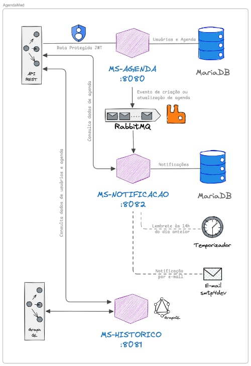

# AgendaMed - Sistema de Agendamento Hospitalar

Este repositório contém o código-fonte do projeto **AgendaMed**, desenvolvido como entrega da **Fase 3** do curso de Pós-Graduação em **Arquitetura e Desenvolvimento em Java** da **FIAP**.

O projeto consiste em um *backend* robusto baseado em microsserviços para gerenciar agendamentos médicos, históricos de pacientes e notificações automatizadas, focando em segurança, escalabilidade e comunicação assíncrona.

## 📋 Visão Geral

O objetivo deste desafio foi desenvolver uma solução para mitigar problemas de agendamento e ausências em consultas hospitalares. A solução implementa:

* **Segurança (RBAC):** Autenticação via JWT com perfis distintos (Admin, Médico, Enfermeiro, Paciente).
* **Comunicação Assíncrona:** Uso de mensageria (RabbitMQ) para envio de e-mails sem bloquear o fluxo principal.
* **Flexibilidade de Dados:** API GraphQL para consultas personalizadas de histórico.
* **Automação:** *Schedulers* para envio de lembretes diários às 14h do dia anterior à consulta.

## 🏗️ Arquitetura da Solução

A solução segue o padrão de arquitetura de microsserviços, utilizando o padrão *Database per Service* para garantir o desacoplamento.



### Microsserviços

1.  **MS-AGENDA (Porta 8080):**
    * *Core* do sistema, responsável por usuários e agendamentos.
    * Segurança via Spring Security e JWT.
    * Persistência em MariaDB.
    * Produtor de eventos para o RabbitMQ.

2.  **MS-NOTIFICACAO (Porta 8082):**
    * Gerencia o envio de e-mails (confirmação e lembretes).
    * Consome mensagens da fila `CONSULTA_CREATED` no RabbitMQ.
    * Executa rotina agendada (*Scheduler*) diariamente para lembretes.
    * Utiliza o **smtp4dev** para simulação de envio de e-mails.

3.  **MS-HISTORICO (Porta 8081):**
    * Interface de leitura flexível via **GraphQL**.
    * Permite consultas personalizadas para evitar *over-fetching*.
    * Consome dados do MS-AGENDA via integração HTTP síncrona.

## 🚀 Tecnologias Utilizadas

* **Java 17+** & **Spring Boot 3**
* **Spring Security** (OAuth2 Resource Server / JWT)
* **Spring AMQP** (RabbitMQ)
* **Spring for GraphQL**
* **Docker** & **Docker Compose**.
* **MariaDB** (Banco de Dados Relacional).
* **Smtp4Dev** (Servidor de e-mail Mock).

## 📦 Como Executar o Projeto

O projeto é totalmente containerizado para facilitar a execução e testes. Certifique-se de ter o **Docker** e o **Docker Compose** instalados.

Siga os passos abaixo:

1.  **Clonar o repositório:**
    ```bash
    git clone [https://github.com/andclima/agendamed.git](https://github.com/andclima/agendamed.git)
    ```

2.  **Acessar o diretório do projeto:**
    ```bash
    cd agendamed
    ```

3.  **Subir o ambiente com Docker Compose:**
    ```bash
    docker compose up -d
    ```
    Este comando irá construir as imagens dos microsserviços e iniciar os containers de infraestrutura (Banco de dados, RabbitMQ e SMTP).

> **Nota:** Aguarde alguns instantes após o comando para que os serviços de banco de dados e mensageria estejam totalmente inicializados antes de realizar requisições.

## 🔗 Acesso aos Serviços e Monitoramento

Após a inicialização, os serviços estarão disponíveis nos seguintes endereços locais:

| Serviço | URL / Endereço | Credenciais (se aplicável) |
| :--- | :--- | :--- |
| **API Gateway (Agenda)** | `http://localhost:8080` | Requer Token JWT |
| **Interface GraphQL (GraphiQL)** | `http://localhost:8081/graphiql?path=/graphql` | -  |
| **RabbitMQ Management** | `http://localhost:15672` | User: `admin` / Pass: `123`  |
| **E-mails (Smtp4Dev)** | `http://localhost:3000` | -  |

## 🧪 Testando a API

### Postman Collection
Uma *collection* completa do Postman foi incluída no projeto para validar todos os endpoints REST e consultas GraphQL.

* **Arquivo local:** `/collection-postman/techchallenge-fase-3.postman_collection.json`.
* **Link do Repositório:** [Acessar Collection no GitHub](https://github.com/andclima/agendamed/blob/main/collection-postman/techchallenge-fase-3.postman_collection.json).

### Autenticação
Para realizar chamadas, utilize o endpoint `/login` (público) para obter um token JWT. O sistema possui validação de perfis (Scopes):
* **ADMIN:** Gestão total de usuários.
* **MEDICO:** Gestão de consultas e prontuários.
* **ENFERMEIRO:** Agendamento e triagem.
* **PACIENTE:** Visualização de agendamentos próprios.

## 👤 Autor

* **Anderson Lima**

---
*Projeto acadêmico - FIAP Pós Tech - Arquitetura e Desenvolvimento em Java.*